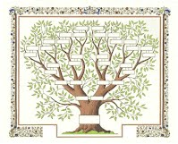
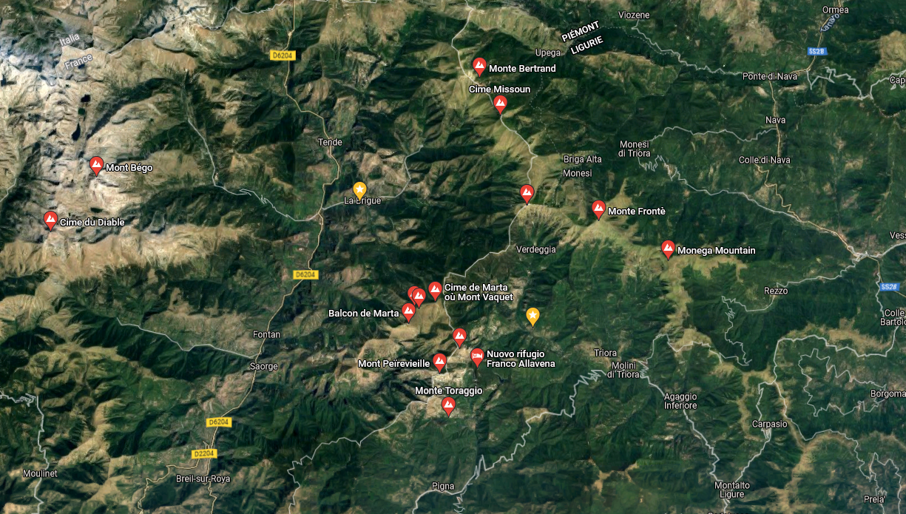

# Bienvenue !

> **Nouveau format du site en construction**

**Pourquoi les rois qui possèdent tout sauf le bonheur seraient-ils les seuls à avoir le droit de connaître leur famille ?**

{ align=right }

Pourquoi Anne L. (née à Bourg-la-Reine en 1995), Thibaut L. (né à Rouen en 1985), Julien C. (né à Toulon en 1976), Stéphanie S. (née à Bordeaux en 1977) et Christiane Le M. (née à Toulon en 1947) devraient-ils ignorer le lien qu’il y a entre eux ?

Car malgré la diversité des noms et des lieux, ils ont tous le même trisaïeul ou quadraïeul, Antoine Lanteri, né le 14 juin 1828 et qui, riche seulement de ses deux bras, s’établit en France autour de 1850. D’où venait-il ?

De La Brigue à Triora, des villages de montagne au nord de San Remo et de Menton, entourés au nord de la cime Missoun (2 356 m.) et de la pointe Marguareis (2 650 m.), au sud de la cime de Marta (2 138 m.) et du mont Peïrevieille (2 038 m.), à l'ouest du mont Bego (2 872 m.) et de la cime du Diable (2 685 m.), à l'est du mont Monega (1 882 m.) et au centre de cette zone le mont Saccarel (2 200 m.) qui fait frontière entre France et Italie, les Lantéri occupent le terrain depuis des siècles.

!!! info "Il existe (_au moins_) 2 théories sur l'origine des Lanteri"

    - soit ils sont les descendants de la tribu celto-ligure des **Epanterii** dès l'antiquité (protohistoire),
    - soit ce sont des **Lombards** arrivés au Moyen-age (VI siècle de notre ère).

    C'est ce que nous allons essayer de vous décrire dans la partie ==Histoire== de ce site.
